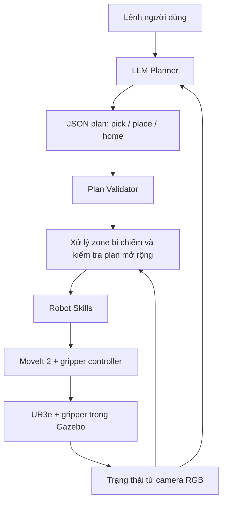

# UR3e — LLM Skill Planning với Gripper và Camera

Dự án Bài 03 sử dụng ROS 2 Humble, Gazebo Fortress và MoveIt 2 để điều khiển
UR3e bằng ngôn ngữ tự nhiên. Robot quan sát bàn qua camera RGB, gắp/thả vật bằng
gripper hai ngón và tự dọn vật đang chiếm zone trước khi đặt vật được yêu cầu.

Môi trường gồm một robot, gripper, camera, bàn thao tác, ba zone (`zone_a`,
`zone_b`, `zone_c`) và năm cube: đỏ, vàng, xanh dương, xanh lá, tím.



LLM chọn skill, tham số và thứ tự thực hiện. MoveIt 2 lập kế hoạch chuyển động
và kiểm tra va chạm. Tọa độ cube được nhận dạng từ ảnh camera; gripper giữ vật
bằng ràng buộc vật lý chỉ được tạo sau khi cả hai ngón tiếp xúc với cube.

## 1. Chuẩn bị và build

Môi trường sử dụng: **Ubuntu 22.04, ROS 2 Humble, Gazebo Fortress 6.x**.
Cần có `colcon`, `rosdep` đã cấu hình, MoveIt 2, các package Universal Robots
và tích hợp ROS–Gazebo. LLM thật cần API key cùng endpoint/model hợp lệ;
demo ở mục 2 chạy được không cần API.

Nếu chưa tải dự án:

```bash
mkdir -p ~/workspaces
git clone https://github.com/linhnghu/ur3-llm-gripper-camera.git ~/workspaces/ur_gz
```

Trong workspace mới hoặc workspace đang có:

```bash
cd ~/workspaces/ur_gz
source /opt/ros/humble/setup.bash
rosdep install --from-paths src --ignore-src -r -y --skip-keys ament_python
colcon build --symlink-install --packages-select \
  ur_simulation_gz ur3_grasp_plugin ur3_draw_letter ur3_llm_control
source install/setup.bash
```

`ament_python` là kiểu build của package Python. Lệnh trên bỏ qua key này vì
cơ sở dữ liệu rosdep trên môi trường Humble/Jammy hiện tại không resolve được;
package Python vẫn được build qua colcon/setuptools.

## 2. Chạy demo zone bị chiếm

```bash
cd ~/workspaces/ur_gz
source /opt/ros/humble/setup.bash
source install/setup.bash
ros2 launch ur3_llm_control llm_robot.launch.py \
  command:='Put the red cube in zone B.' demo_plan:=true
```

Launch mở Gazebo, RViz, MoveIt, camera bridge và các controller. Task node bắt
đầu sau khoảng **40 giây**, rồi đợi camera có dữ liệu mới và ổn định. Trong RViz
có display `Table Camera` để xem ảnh bàn.

Zone B ban đầu chứa `blue_cube`. Kết quả mong đợi:

1. Camera nhận dạng các cube và xác định B đang bị chiếm.
2. Tìm vị trí trống trên bàn, gắp blue và đặt ra vị trí tạm.
3. Kiểm tra B đã trống, gắp red và đặt vào B.
4. Về home, dùng camera xác nhận kết quả.

`demo_plan:=true` dùng **plan mẫu cố định**, chỉ hỗ trợ câu lệnh trên. Chế độ này
kiểm tra camera, gripper và thực thi chuyển động; phần hiểu ngôn ngữ bằng LLM
được sử dụng ở mục 3.

Dừng launch bằng **Ctrl+C** trước khi chuyển sang ví dụ khác. Trong cùng
ROS domain, chỉ chạy một phiên điều khiển robot tại một thời điểm.

## 3. Điều khiển bằng LLM

Chế độ `continuous:=true` cho phép nhập nhiều lệnh trong cùng phiên mô phỏng.
Mỗi nhiệm vụ đọc lại camera, gọi LLM, kiểm tra plan rồi thực thi. Đây là điều
khiển ở mức nhiệm vụ; thời gian phản hồi phụ thuộc camera, mạng và model.

### Terminal 1 — mô phỏng và planner

Khởi động gateway LLM trước. Ví dụ dưới dùng gateway local ở cổng `20128`;
**thay `TEN_MODEL_TRONG_GATEWAY` bằng model ID thực tế** và thay endpoint nếu
dịch vụ của bạn dùng địa chỉ khác. Endpoint phải là URL đầy đủ của API
chat completions. Client yêu cầu API key cả khi dùng gateway local.

```bash
cd ~/workspaces/ur_gz
source /opt/ros/humble/setup.bash
source install/setup.bash
read -rsp "API key của gateway: " NINEROUTER_API_KEY
printf '\n'
export NINEROUTER_API_KEY
ros2 launch ur3_llm_control llm_robot.launch.py \
  continuous:=true demo_plan:=false \
  endpoint:=http://localhost:20128/v1/chat/completions \
  model:=TEN_MODEL_TRONG_GATEWAY \
  student_id:=23020749 \
  evidence_path:=/tmp/llm_task.json
```

Giữ API key trong môi trường shell; không ghi vào README, commit hoặc video.
Chờ log `CONTINUOUS READY` trước khi gửi lệnh.

### Terminal 2 — nhập lệnh

```bash
source /opt/ros/humble/setup.bash
source ~/workspaces/ur_gz/install/setup.bash
ros2 run ur3_llm_control llm_command
```

Nhập từng câu sau dấu `LLM >`, chờ nhiệm vụ kết thúc rồi nhập câu tiếp theo:

```text
put red to zone a
swap red and blue
Put the green cube in zone C.
exit
```

CLI hiển thị `ACCEPTED → PLANNING → VALIDATED → EXECUTING → SUCCEEDED`.
Robot xử lý một nhiệm vụ tại một thời điểm; lệnh gửi khi đang bận bị `REJECTED`.
Hai terminal phải dùng cùng `ROS_DOMAIN_ID`.

Để gửi một lệnh từ terminal hoặc script:

```bash
ros2 run ur3_llm_control llm_command --command 'Put the red cube in zone B.'
```

Thêm `execute:=false` vào lệnh **launch** để chỉ đọc camera, gọi LLM và kiểm tra
plan. Kết quả khi đó là `PLANNED`. Lỗi planning cho phép nhập lại; lỗi sau khi
bắt đầu execution đưa phiên vào `FAULT`, cần kiểm tra rồi khởi động lại mô phỏng.

`exit`, EOF hoặc Ctrl+C ở CLI chỉ đóng client; nhiệm vụ đang chạy vẫn tiếp tục.
Ctrl+C ở terminal launch kết thúc phiên mô phỏng.

## 4. Cấu hình và trạng thái ban đầu

Trạng thái world khi khởi động khác với mapping đích theo MSSV:

| Zone | Vật ban đầu trong world | Mapping MSSV `23020749` |
| --- | --- | --- |
| `zone_a` | Trống | `red_cube` |
| `zone_b` | `blue_cube` | `blue_cube` |
| `zone_c` | `purple_cube` | `yellow_cube` |

Red, yellow và green ban đầu nằm ngoài các zone. Camera xác định trạng thái thực
tế sau mỗi thao tác. Câu lệnh chỉ định đích rõ ràng luôn được ưu tiên hơn mapping.
`Arrange all objects according to my student ID.` yêu cầu sắp xếp **ba cube trong
mapping**; hai cube còn lại có thể được dọn nếu chắn zone đích.

| Tham số launch | Mặc định | Ý nghĩa |
| --- | --- | --- |
| `continuous` | `false` | Giữ planner hoạt động để nhận nhiều lệnh |
| `command` | Rỗng | Câu lệnh cho một task, hoặc task đầu của phiên liên tục |
| `demo_plan` | `false` | Dùng plan mẫu đưa red vào B khi bật |
| `execute` | `true` | Thực thi sau khi kiểm tra plan |
| `endpoint` | `https://9router.com/v1/chat/completions` | API chat completions |
| `model` | `gpt-4o-mini` | Model ID gửi tới gateway |
| `gazebo_gui`, `launch_rviz` | `true` | Hiển thị Gazebo và RViz |
| `record_path` | Rỗng | Đường dẫn video camera `.mp4` |
| `evidence_path` | Rỗng | Đường dẫn JSON kết quả; chế độ liên tục thêm task ID vào tên file |

đọc để cấu hình runtime.

Các file thường cần chỉnh nằm trong `src/ur3_llm_control`:

- [worlds/task_world.sdf](src/ur3_llm_control/worlds/task_world.sdf): vị trí khởi tạo vật và mô hình Gazebo. Sửa world cần khởi động lại mô phỏng.
- [config/scene.yaml](src/ur3_llm_control/config/scene.yaml): hiệu chuẩn camera, kích thước bàn/cube, zone và miền tìm buffer. Thay camera/bàn/zone cần cập nhật cấu hình tương ứng.

## 5. Mã nguồn và bằng chứng demo

| Package | Chức năng |
| --- | --- |
| `ur3_llm_control` | Planner, validators, perception, resolver, robot skills và CLI |
| `ur3_grasp_plugin` | Constraint giữ vật trong Gazebo sau tiếp xúc hai ngón |
| `ur3_draw_letter` | URDF/gripper, controller, cấu hình MoveIt và demo vẽ chữ L |
| `ur_simulation_gz` | Hỗ trợ launch mô phỏng UR; mã nguồn được đưa đầy đủ vào repo |

Chi tiết thiết kế: [README của package](src/ur3_llm_control/README.md) và
[báo cáo Bài 03](src/ur3_llm_control/REPORT_BAI03.md).

Bằng chứng đã lưu ngày 05/10/2026:

- [Demo zone B bị chiếm](artifacts/lesson3/VALIDATION.md): Gazebo/RViz, 7/7 bước thành công, 8/8 đường Cartesian đạt 100%; có [video camera](artifacts/lesson3/demo_camera.mp4).
- [Lệnh liên tục](artifacts/realtime/VALIDATION.md): nhiều task trong một phiên, từ chối khi bận và chống chạy lại task ID.
- [Khắc phục camera khi swap](artifacts/camera_recovery/VALIDATION.md): **29/29 unit tests**; chuỗi red → A rồi swap red/blue hoàn thành 5/5 và 10/10 bước.

Hai demo đầu dùng plan mẫu offline. Lần regression swap dùng HTTP fixture trả
hai plan lấy từ [log LLM của người dùng](artifacts/camera_recovery/original_user_run.log);
không gọi model thật trong lần kiểm thử đó. Video lưu sẵn chỉ ghi ảnh camera.
Khi nộp demo LLM, cần quay thêm câu lệnh, phản hồi plan, Gazebo và RViz.

Chạy unit tests từ thư mục gốc:

```bash
source /opt/ros/humble/setup.bash
PYTHONPATH="src/ur3_llm_control:$PYTHONPATH" /usr/bin/python3 -m pytest src/ur3_llm_control/test -q
```

## 6. Lỗi thường gặp

| Hiện tượng | Cách xử lý |
| --- | --- |
| Không tìm thấy package/executable | Build lại, source ROS và `install/setup.bash` trong terminal hiện tại |
| API trả `401` hoặc báo thiếu key | Export `NINEROUTER_API_KEY` trong terminal launch; kiểm tra key được gateway chấp nhận |
| Không kết nối API hoặc model không tồn tại | Kiểm tra gateway đang chạy, endpoint đầy đủ và model ID thực tế |
| CLI chưa thấy server | Đợi khoảng 40 giây; kiểm tra `continuous:=true`, log `CONTINUOUS READY` và cùng ROS domain |
| `No fresh stable camera state; missing [...]` | Kiểm tra ảnh `Table Camera`, vị trí vật và vật bị che. Khi đang giữ vật trước place, code có cơ chế đổi tư thế để nhìn lại; vẫn thiếu dữ liệu thì task dừng |
| Session ở `FAULT` | Kiểm tra vật robot đang giữ, dừng launch, build/source nếu vừa sửa code rồi khởi động lại mô phỏng |
| Gripper đóng nhưng vật không đi theo | Kiểm tra tiếp xúc hai ngón và physics ACK `attached`; chỉ controller báo thành công chưa chứng minh đã gắp được vật |
